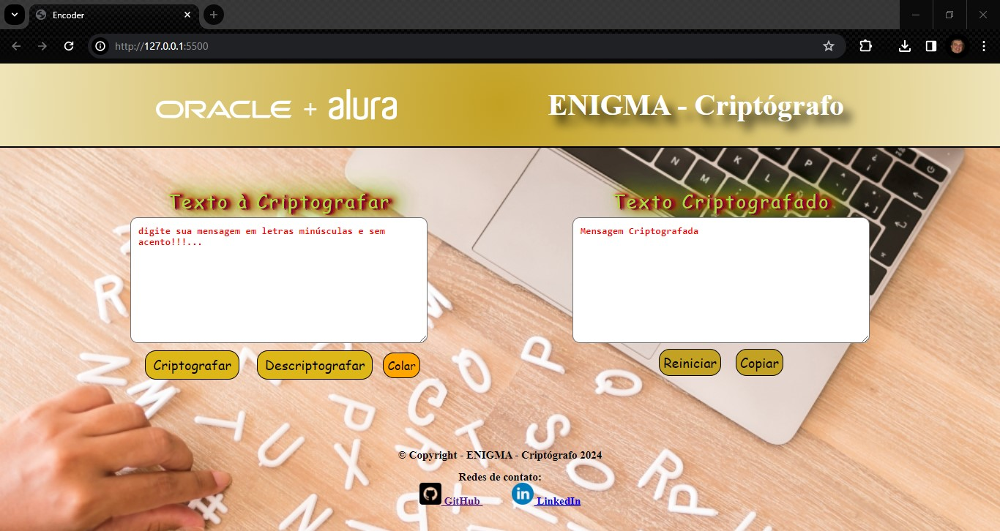
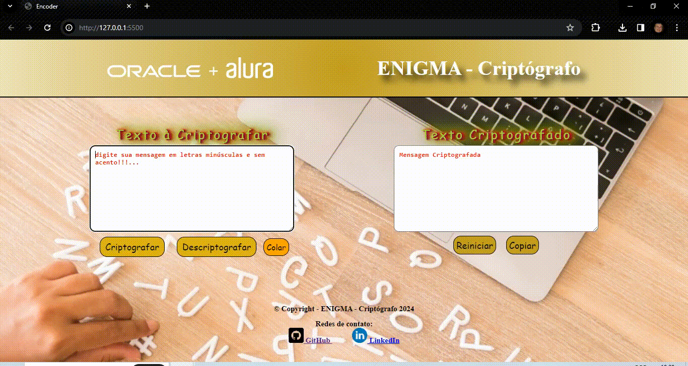
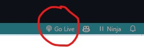

# Challenge - Alura + Oracle - Turma 6 - Criptografia

### Alura + Oracle – Programa ONE

#### Criação de uma página com uma aplicação para Criptografia e Descriptografia de texto

### 🔗 Links
[](https://github.com/ricardo-werner)

[](https://www.linkedin.com/in/ricardo-werner)


### Status - Concluído

### Demonstração

Tela do Enigma- Criptógrafo
<p align="center">
  
</p>

Video do funcionamento do Enigma- Criptógrafo
<p align="center">
    
</p>


### O Desafio
Neste desafio foi proposto criar uma aplicação que criptografa textos, assim poderemos trocar mensagens secretas com outras pessoas que saibam o segredo da criptografia utilizada.

### Requisitos da Aplicação

| Item  | Descrição                                            
| ----- | ---------------------------------------------------------------------- |
|  1    |  A  aplicação deverá ser desenvolvida em HTML, CSS e JavaScript.                           |
|  2    |  A Aplicação deverá seguir os cartões do Trello.                       |
|  3    |  Modelagem do layout, formatos, tipografias. cores e organização Figma.|
|  3.1  |  Opcional podendo fazer a modelagem de modo livre.               |
|  4    |  Deverá funcionar com letras minúsculas                |
|  5    |  Não deverá ser utilizada letras com acentos e nem caracteres especiais                |
|  6    |  Deverá ser possível converter para a versão criptografada e também retornar para a palavra original                |
|  7    |  A Aplicação poderá ter um botão que copie o texto criptografado ou descriptografado para a área de transferência ( Ctrl + C => Ctrl +V)                |
|  8    | - Utilização obrigatória de keys (vogais), sendo:
|       |   - vogal a => ai        |
|       |   - vogal e => enter      |
|       |   - vogal i => imes      |
|       |   - vogal o => ober      |
|       |   - votal u => ufat  |

### Plano do Projeto
No desenvolvimento desta aplicação, colocamos em prática:

| Item  | Descrição                                            
| ----- | ------------- |
|  1    |  HTML         |
|  2    |  CSS          |
|  3    |  JavaScript   |
|  4    |  Skills       |

### Tecnologias utilizadas:
- Visual Studio Code
- HTML
- CSS
- JavaScript

Explorar este projeto foi uma experiência incrivelmente enriquecedora, que me permitiu aprofundar significativamente meu conhecimento na criação básica de uma aplicação, envolvendo HTML, CSS e JavaScript. Durante essa jornada, descobri a notável flexibilidade e a impressionante capacidade de adaptação dessas tecnologias. Além disso, essa experiência também me guiou em uma reflexão profunda sobre a importância da estruturação inteligente de aplicações, com o objetivo de facilitar futuras manutenções.

## Para utilizar esta aplicação como base, faça o seguinte passo-a-passo:
Clone o projeto para a sua máquina:
```bash
https://github.com/ricardo-werner/ONE_Challenge1_Criptografia.git
```
Rode o aplicativo na web ativando o go live no Vs Code (click em cima do go live para ativar):
<p align="center">
  

<p align="center">
  

Resultado na página da web:
<p align="center">
  
</p>

#### Para verificação do projeto sem a necessidade de clonar o repositório, acesse o link abaixo:
```bash
https://rocketseat-nlw-expert-react-js-notes.vercel.app/
```


## Autor
Ricardo Werner – Desenvolvedor sempre em desenvolvimento
